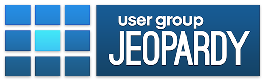

# User Group Jeopardy

A fun and interactive way to give user group presentations. This app uses Node, Express, Jade, CoffeeScript, SASS, AngularJS, Socket.IO, YAML, and Markdown.

## Demo

[https://www.youtube.com/watch?v=5z14Vczdpfc](https://www.youtube.com/watch?v=5z14Vczdpfc)

## Requires

1. NPM
2. Grunt
3. Node
4. Other dependencies installed by NPM

## Setup

1. npm install (in `./` and  `./src/` )
2. grunt build
3. cd build/
4. node app.js

## Development

You can run `grunt watch` to monitor and rebuild the site in response to changes. **Note**: this doesn't watch for changes to presentations in the `data` directory.

## Configuration

For the most part, configuration values are self explanatory.

`types` is used to add, change, or remove presentations that should be loaded into memory. This should represent the name of the **directory** that holds the presentation information.

## Writing Presentations

The `css` directory has an example presentation. *Additional information will be added later*.

## Presentation Controls

* The presenter screen should start the User Group Jeopardy game
* Clicking on a block will open that section and show the slides for that area
* Move the mouse to the bottom of the screen to see controls and the presentation ID
* Use the `>` or `spacebar` to navigate forward
* Use the `<` key to navigate backwards
* Use the `z` key to close the section (and not finish it)
* A small grey spinning icon appears in the top right corner when you're on a slide right before the questions.

## FAQ

#### Is this available as a public site?

No, you'll have to host it yourself. Local WiFi is ideal, but it works just fine over the web.

#### How does it keep score?

Scores are **not** tracked on the server. In my presentation, I gave out Monopoly money to participants and then they add it up themselves at the end. "Monopoly Empire" has only $50, $100, and $500 bills, which makes it ideal for this sort of thing.

#### Does this only work for code presentations?

No, slides can cover any topic you like. Questions can be either multiple choice or free form, but they don't have to be limited to code related topics.

## TODO

Here are a few more remaining problems

1. User login is confusing ( the way the errors are handled )
2. Requires more error messages
3. Need to finish CSS for more column and row counts
4. Add a route that handles loading /resource/* into /data/presentation/*
5. Implement /theme.css property in presentations (for custom UI per presentation)
6. Build mobile friendly 'Remote Control'
7. Add an indication when you're on the last question in a section
8. Over all UI improvements (transitions, animations, sounds?, etc)
